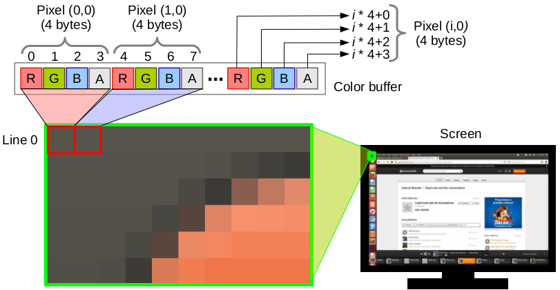
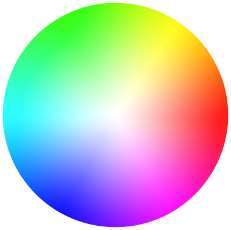

# Introduction to Rasterization Algorithms

## **Abstract:** 

In this activity,  I will discuss and implement algorithms or the rasterization of points and lines. The rasterization of these primitives will be done by simulating direct access to video memory. As current operating systems protect memory from direct access, I will use a framework, provided by the professor, that simulates access to video memory.

---

## Introduction

### Digital Images

A digital image is composed of *pixels*, each with finite, discrete quantities of numeric representation for its intensity. The digital image contains a fixed number of rows and columns of pixels, typically stored in computer memory as a *raster image*, a two-dimensional array of small integers, each represents an associated color to a specific pixel.

Therefore, in the RGB standard, each pixel consists of three channels, each representing a color (R for red, G for green and B for blue). Usually, 8 bits are reserved for each component(channel), which is distinguished in 256 different intensity levels for each color, resulting in approximately 16 million colors reproduced in total. Additionally, channel A (alpha) can be used for transparency. Consequently, the representation of the components of an RGBA space is given as follows:

  

*Figura 1:* Representation of an RGBA image storage

  

*Figura 2:* Representation of an RGB color wheel

