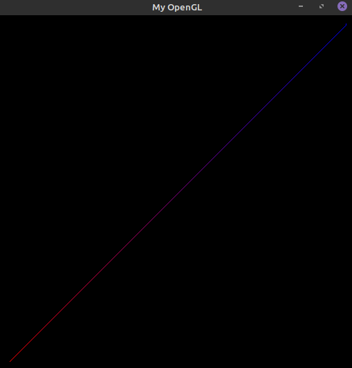
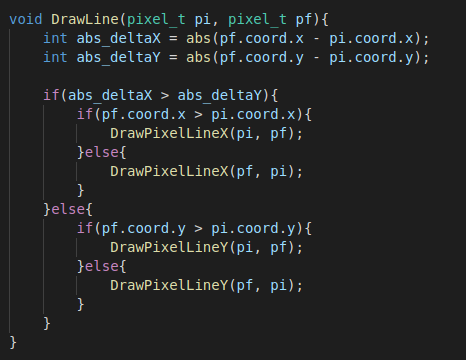
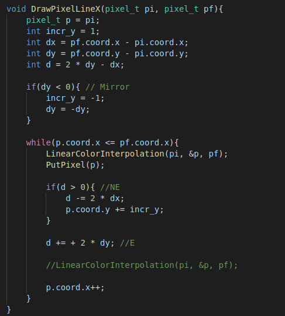
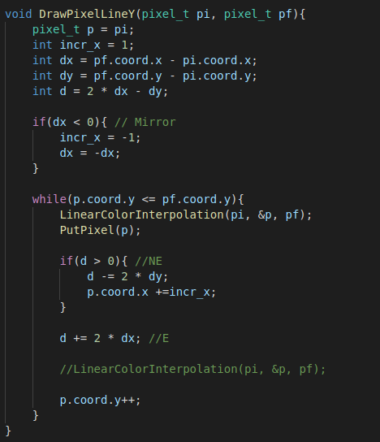

# Introduction to Rasterization Algorithms

## **Abstract:** 

In this activity,  I will discuss and implement algorithms or the rasterization of points and lines. The rasterization of these primitives will be done by simulating direct access to video memory. As current operating systems protect memory from direct access, I will use a framework, provided by the professor, that simulates access to video memory.

---

## The Framework

Considering current operating systems protect memory from direct access, a framework provided by the professor will be used to simulate access to video memory. The framework files can be accessed in the [myGL Framework](https://github.com/jpvt/Computer_Graphics/tree/master/Assignment%20%231/mygl_framework) repository.

The Framework structure, dependencies and compilation instructions are described in [myGL Framework](https://github.com/jpvt/Computer_Graphics/tree/master/Assignment%20%231/mygl_framework).

---

**NOTE:** This is the short version of the assignment's article. If you want the long version explaining details about digital images and rasterization(basically a newbies guide), please access the [long version](https://github.com/jpvt/Computer_Graphics/blob/master/Assignment%20%231/article.md).

## Features

 * **PutPixel:** Rasterizes a point in the video memory that receives as parameters as x (y) coordinates of the pixel on the screen and its color (RGBA).

Figure 1. PutPixel in action

  

Figure 1.2. Pixel struct, SetPixel ,and PutPixel Functions declaration

Figure 1.3. SetPixel, PutPixel functions

 * **DrawLine:** Rasterizes a line on the screen, taking as parameters the coordinates of its initial and final vertices (represented by tuples (x0, y0) and (x1, y1) respectively) and the colors (in RGBA format) of each vertex. The colors of the pixels along the rasterized line were obtained by linear interpolation of the colors of the vertices. The line rasterization was made through Bresenham's Algorithm.

Figure 2. DrawLine in action

Figure 2.2. DrawLine Function

Figure 2.3. DrawLineX Function

Figure 2.4. DrawLineY Function

 * **DrawTriangle:** Function that draws as parts of a triangle on the screen, taking as parameters as positions of three vertices (x0, y0), (x1, y1) and (x2, y2) as well the colors (RGBA) of each of the vertices. As pixel centers of the edges of the triangle, they must be activated from the linear interpolation of the colors of their vertices.

 

Figure 3. DrawTriangle in action

## Difficulties

The main difficulty in this assignment was to adapt the midpoint algorithm to all octants on the DrawLine function. I also had some bugs with the Linear Color Interpolation algorithm, but after a few minutes it was solved.

## Credits

 * https://www.cs.helsinki.fi/group/goa/mallinnus/lines/bresenh.html
 * https://en.wikipedia.org/wiki/Digital_image
 * Prof. Christian Notes
