# Introduction to Rasterization Algorithms

## **Abstract:** 

In this activity,  I will discuss and implement algorithms or the rasterization of points and lines. The rasterization of these primitives will be done by simulating direct access to video memory. As current operating systems protect memory from direct access, I will use a framework, provided by the professor, that simulates access to video memory.

---

## The Framework

Considering current operating systems protect memory from direct access, a framework provided by the professor will be used to simulate access to video memory. The framework files can be accessed in the [myGL Framework](https://github.com/jpvt/Computer_Graphics/tree/master/Assignment%20%231/mygl_framework) repository.

The Framework structure, dependencies and compilation instructions are described in [myGL Framework](https://github.com/jpvt/Computer_Graphics/tree/master/Assignment%20%231/mygl_framework).

---
## Introduction

A digital image is composed of *pixels*, each with finite, discrete quantities of numeric representation for its intensity. The digital image contains a fixed number of rows and columns of pixels, typically stored in computer memory as a *raster image*, a two-dimensional array of small integers, each represents an associated color to a specific pixel.

Therefore, in the RGB standard, each pixel consists of three channels, each representing a color (R for red, G for green and B for blue). Usually, 8 bits are reserved for each component(channel), which is distinguished in 256 different intensity levels for each color, resulting in approximately 16 million colors reproduced in total. Additionally, channel A (alpha) can be used for transparency. Consequently, the representation of the components of an RGBA space is given as follows:

  

Figure 1. Representation of an RGBA image storage

  

Figure 2. Representation of an RGB color wheel

---

## Putting pixels in the monitor

As seen before, a raster image is composed of a two-dimensional space, although the memory is represented linearly. Therefore, it is necessary to calculate an offset so that each pixel (given its position X and Y), occupies a single space in memory.

Consequently, an algorithm was presented in the classroom that performs such allocation, as can be exemplified in the following images:

  

Figure 4. Representation of the image storage

Considering that the number of pixels on the screen is equal to the number of lines multiplied by the number of columns, the memory must have this same number of positions to represent the screen linearly. Therefore, the following algorithm decides the position of each pixel and each channel of a pixel in memory, considering the width in pixels of the screen:

  

Figure 5. Representation of the offset algorithm and color buffer

Thus, the pixel position and the RGBA color definition are required to rasterize a pixel on the screen. To do so, I have created the following structures and functions:

  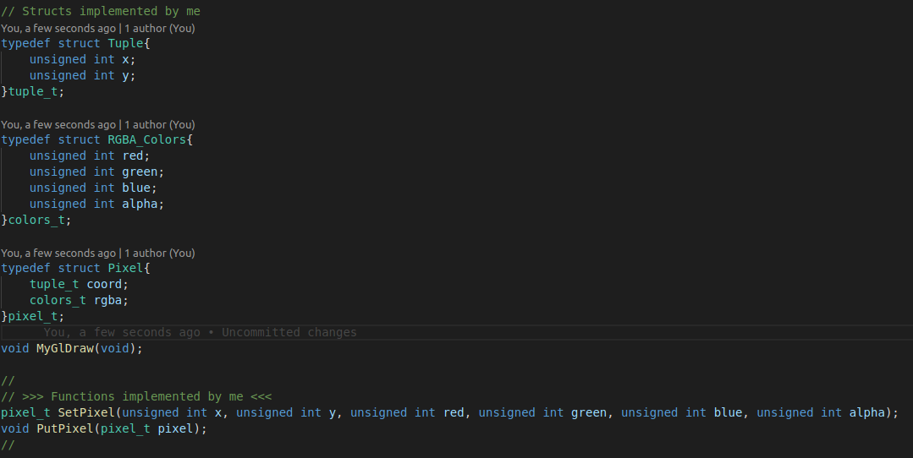

Figure 6. Pixel struct, SetPixel ,and PutPixel Functions declaration

* **PutPixel()**

    After setting the Pixel information, the pixel is ready to be printed in the window with the function **PutPixel** based on the algorithm discussed before.

    

    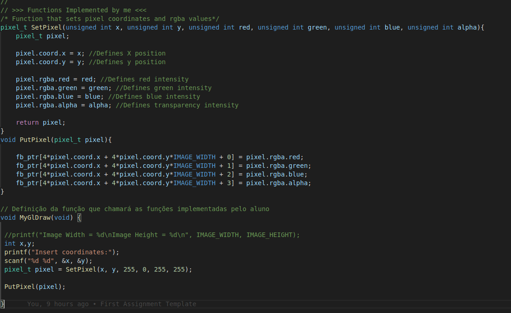
    

    

    Figure 7. SetPixel, PutPixel functions
    

    In the following figure, I have printed 5 pixels in the screen to test my function.

    

    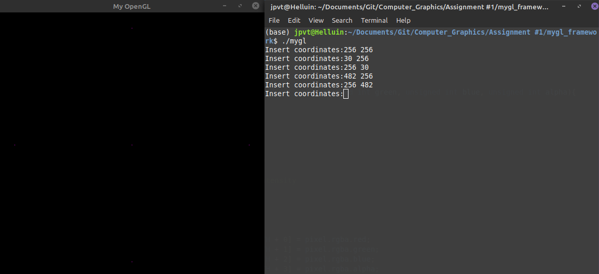
    

    

    Figure 8. PutPixel in action
    

---

## Rasterization

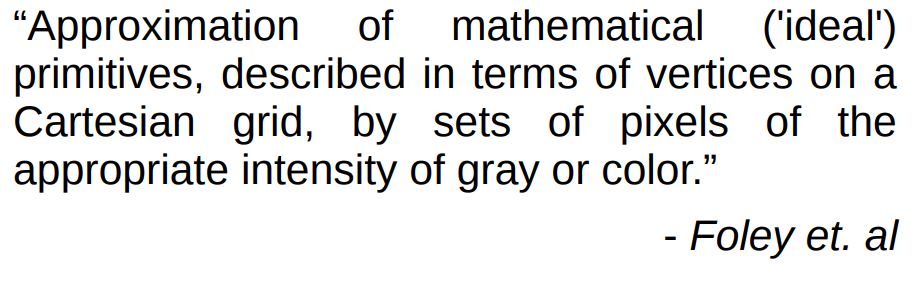

Figure 9. Rasterization definition

Therefore, rasterization is an approximation of continuous variables to a discrete space. So, A line described mathematically is infinitesimally continuous, no matter how small a section of the line is observed, it is impossible to determine which is the next point after a given point; there are no breaks. However, in a discrete space, there are breaks, and it is possible to view each point individually.

Consequently, rasterization can be used to draw a line on the monitor, as this is a discrete two-dimensional space. There is no problem when the line is horizontal, vertical, or diagonal. In such cases, just paint the line, column, or diagonal of pixels.

However, when a line intersects more than one pixel at a given coordinate,  there is ambiguity as to choose which pixel will be painted.

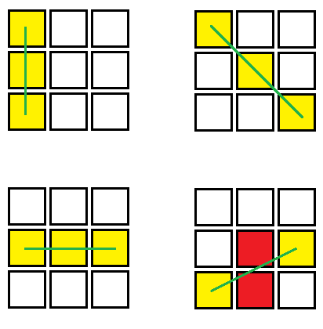

Figure 9. Representation of line rasterization

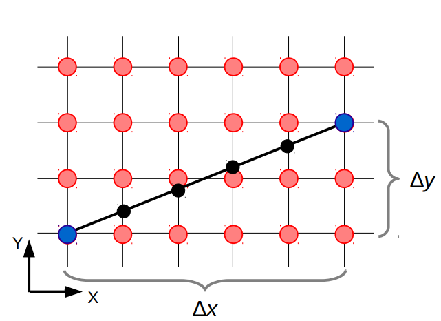

Figure 10. Line rasterization ambiguity example

A simple strategy to solve this problem is to compute the slope *m* between  , to increment *x* by 1 starting with the leftmost point, to calculate    for each , and to intesify the pixel at  , where  .

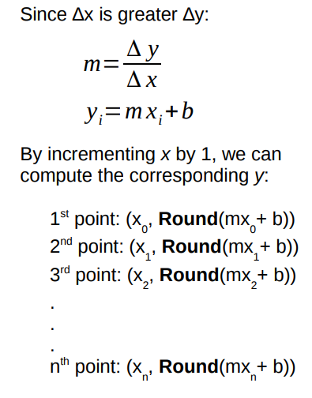

Figure 11. Brute-force strategy

This strategy is called **The Basic Incremental Algorithm**, and it selects the pixel whose distance to the true line is smallest.

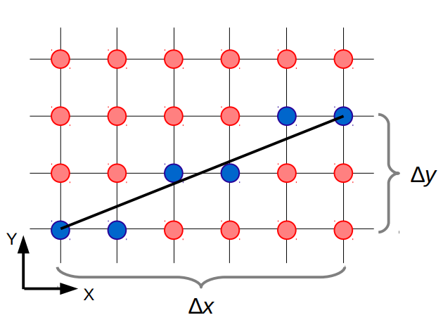

Figure 11. Line rasterization with the Basic Incremental Algorithm

However, this brute-force approach is quite inefficient, because each iteration requires a floating-point multiply, addition, and invocation of Floor. We can eliminate the multiplication by noting that: 

If , then:

This is usually referred as **The DDA(Digital differential analyzer) algorithm**.

### **Bresenham Line Rasterization**

A better solution for our problem is **The Bresenham's line algorithm**, this strategy is one of the earliest developed in the field of computer graphics, and it's known for being a very efficient method to draw lines because it uses only integer addition.

**Assuming that 0 <= *m* <= 1:**

<strong> Therefore </strong>

<strong> Considering that an implicit equation of the line gives us the information if a given point is above, below, or on the line. Let's transform the above equation into an implicit equation for the line.</strong>

<strong> Then </strong>

<strong> In formal notation: </strong>

<strong> What does this information mean to us? </strong>

The main point of Bresenham's line algorithm is to decide which pixel will be painted on the screen, whether it will be the pixel to the east or the northeast since we are only considering the first octant. Consequently, we apply the midpoint between the two pixels in the implicit line equation.

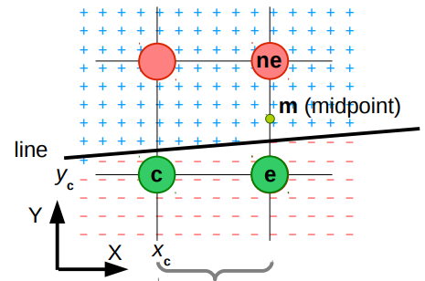

Figure 12.Bresenham's decision process

The decision result will be zero if the midpoint is on the line, positive if it is above, and negative if it is below. 

The pixel to the northeast will be painted if the decision is negative, and if it is positive or equal to zero, the pixel to the east will be painted on the screen.

In fact, this strategy is a variation of Bresenham's original algorithm, referred as **The Midpoint Line Algorithm**.

<strong> Is this more efficient than the previous strategy? </strong>

No, because we're evaluating a whole polynomial every pixel.

<strong> How to make this algorithm efficient? </strong>

It was observed that :

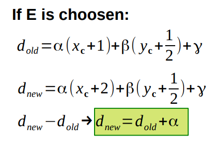

Figure 13. Positive decision 

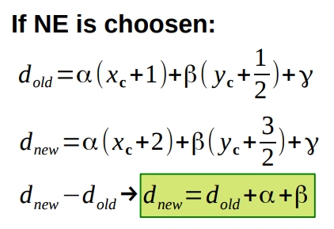

Figure 14. Negative decision

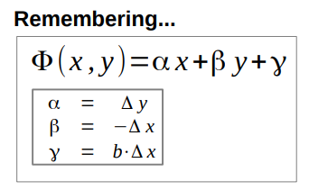

Figure 15. Implicit line equation

<strong> How about the first pixel? </strong>

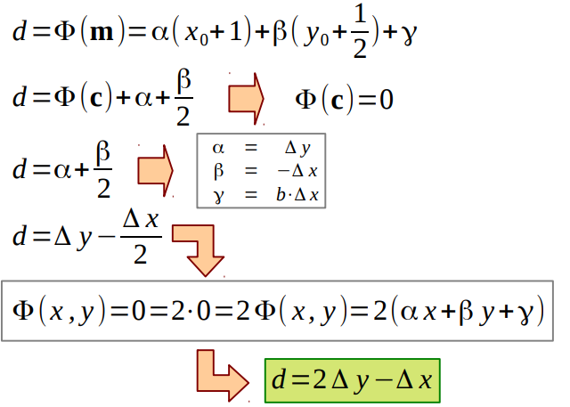

Figure 16. First pixel decision equation

 Now that we know how to draw a line on the first octant, we need to generalize the algorithm for all octants on the screen.

<strong> Octants analysis </strong>

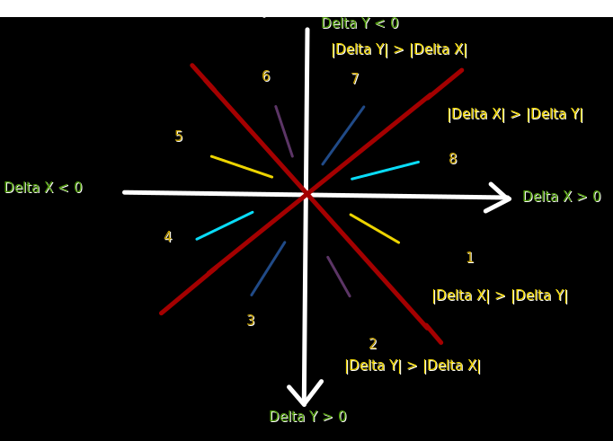

Figure 17. Octants analysis

**1. Slope varies between 0 and 1 (0 <= m <= 1) and initial_X < final_X**

**2. Slope greater than 1 (m > 1) and initial_Y < final_Y**

**3. Slope less than -1 (m < -1) and initial_Y < final_Y**

**4.  Slope varies between 0 and -1 (-1 <= m <= 0) and initial_X > final_X**

**5.  Slope varies between 0 and 1 (0 <= m <= 1) and initial_X < final_X**

**6. Slope greater than 1 (m > 1) and initial_Y > final_Y**

**7. Slope less than -1 (m < -1) and initial_Y > final_Y**

**8.  Slope varies between 0 and -1 (-1 <= m <= 0) and initial_X < final_X**

After the octant analysis it is possible to notice that the octants with negative Delta X can be represented in octants with positive Delta X. Therefore:

 * Octant #6 can be represented in Octant #2;
 * Octant #5 can be represented in Octant #1;
 * Octant #4 can be represented in Octant #8;
 * Octant #3 can be represented in Octant #7;

To do so, I swaped initial X and final X, thus ensuring that the line will be drawn on the positive side of X.

Note that in the second octant, Delta Y is greater than Delta X, consequently, the pixel that is always incremented will be on the Y-axis. Therefore, to transfer to the first octant, everything that was concerning X will now work concerning Y.

For octants #7 and #8, we can mirror the algorithm of octants 2 and 1 respectively, so that the pixel that is always incremented (X in octant 1 and Y in octant 2) is, in this case, decremented, since the line in these octants it grows negatively.

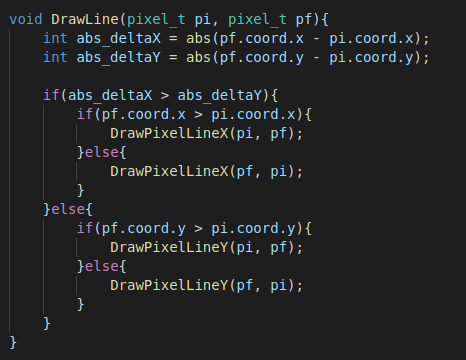

Figure 18. DrawLine Function

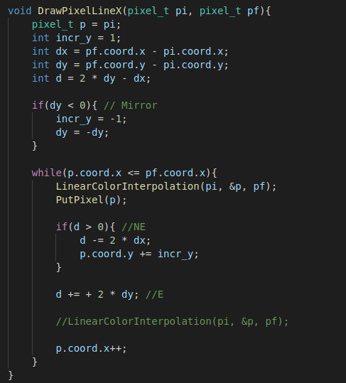

Figure 19. DrawLineX Function

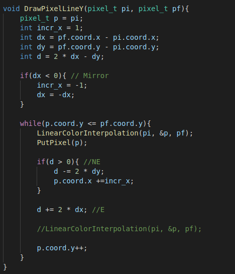

Figure 20. DrawLineY Function

<strong> DrawLine without Linear Color Interpolation </strong>

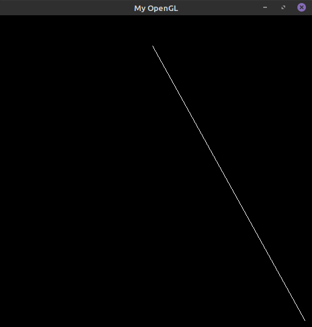

Figure 21. DrawLine in action

### **Linear Color Interpolation**

The Linear Color Interpolation Algorithm consists of interpolating the colors between the start and end points of the line in a linear way, that is, there must be a smooth gradient between the two points of the line.

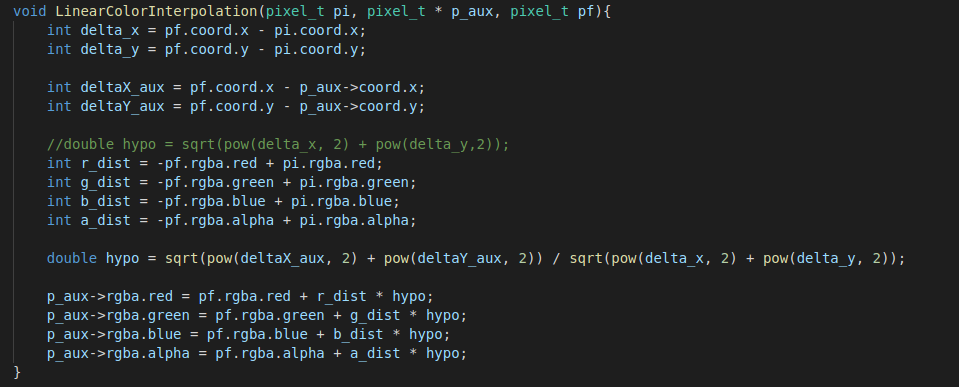

Figure 22. LinearColortIntepolation Function

<strong> DrawLine with Linear Color Interpolation </strong>

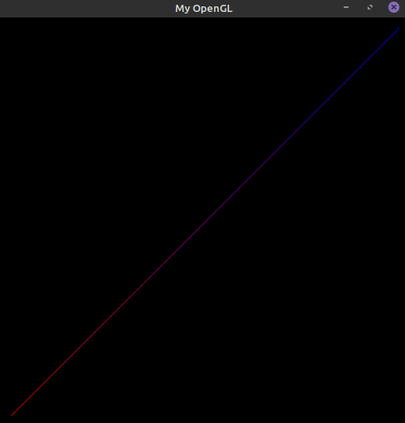

Figure 23. DrawLine + LinearColortIntepolation in action

---

## Drawing a triangle

The most difficult part of the assignment is done. For drawing a triangle on the screen we just need to draw three lines with common vertices. To do so, I've created the following function :

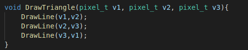

Figure 24. DrawTriangle Function

And that was the result:

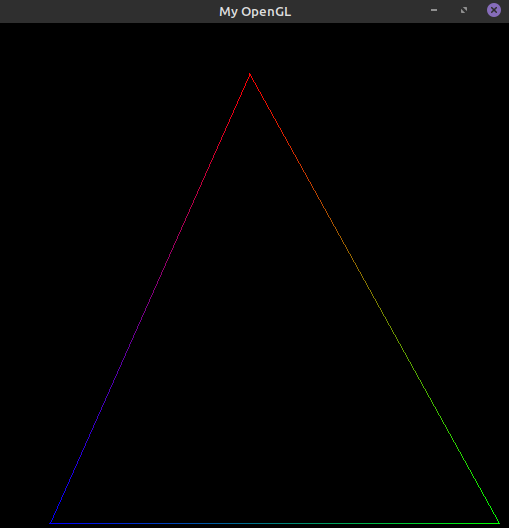

Figure 25. DrawTriangle in action

---
## Difficulties

The main difficulty in this assignment was to adapt the midpoint algorithm to all octants on the DrawLine function. I also had some bugs with the Linear Color Interpolation algorithm, but after a few minutes it was solved.

---

## Credits

 * https://www.cs.helsinki.fi/group/goa/mallinnus/lines/bresenh.html
 * https://en.wikipedia.org/wiki/Digital_image
 * Prof. Christian Notes