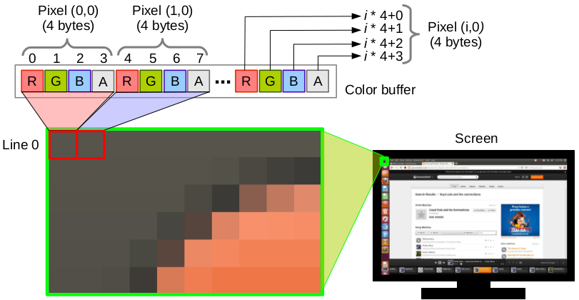
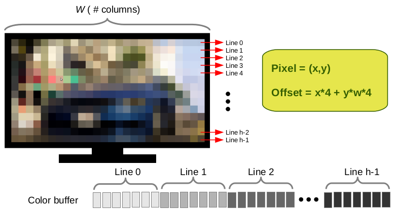
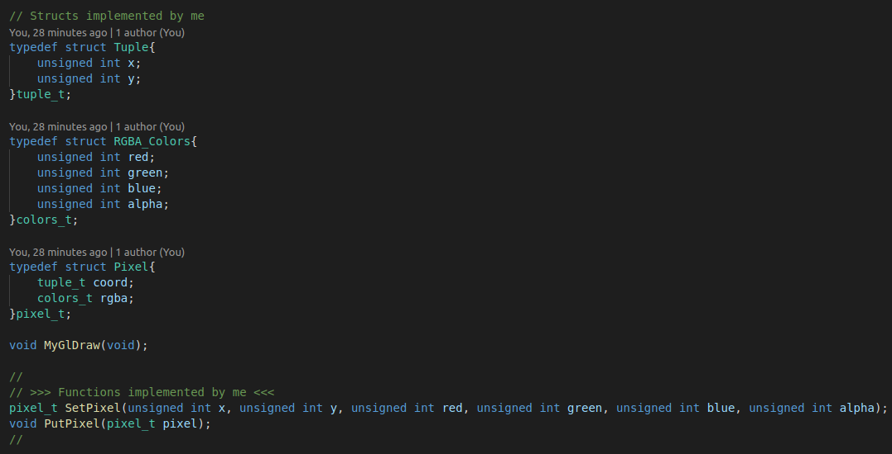
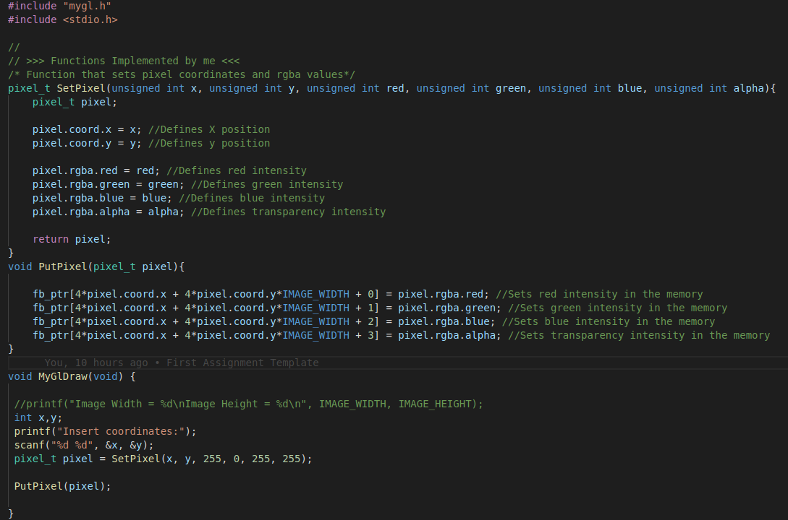

# Introduction to Rasterization Algorithms

## **Abstract:** 

In this activity,  I will discuss and implement algorithms or the rasterization of points and lines. The rasterization of these primitives will be done by simulating direct access to video memory. As current operating systems protect memory from direct access, I will use a framework, provided by the professor, that simulates access to video memory.

---

## The Framework

Considering current operating systems protect memory from direct access, a framework provided by the professor will be used to simulate access to video memory. The framework files can be accessed in the [myGL Framework](https://github.com/jpvt/Computer_Graphics/tree/master/Assignment%20%231/mygl_framework) repository.

The Framework structure, dependencies and compilation instructions are described in [myGL Framework](https://github.com/jpvt/Computer_Graphics/tree/master/Assignment%20%231/mygl_framework).

---
## Introduction

A digital image is composed of *pixels*, each with finite, discrete quantities of numeric representation for its intensity. The digital image contains a fixed number of rows and columns of pixels, typically stored in computer memory as a *raster image*, a two-dimensional array of small integers, each represents an associated color to a specific pixel.

Therefore, in the RGB standard, each pixel consists of three channels, each representing a color (R for red, G for green and B for blue). Usually, 8 bits are reserved for each component(channel), which is distinguished in 256 different intensity levels for each color, resulting in approximately 16 million colors reproduced in total. Additionally, channel A (alpha) can be used for transparency. Consequently, the representation of the components of an RGBA space is given as follows:

  

Figure 1. Representation of an RGBA image storage

  

Figure 2. Representation of an RGB color wheel

---

## Putting pixels in the monitor

As seen before, a raster image is composed of a two-dimensional space, although the memory is represented linearly. Therefore, it is necessary to calculate an offset so that each pixel (given its position X and Y), occupies a single space in memory.

Consequently, an algorithm was presented in the classroom that performs such allocation, as can be exemplified in the following images:

  

Figure 4. Representation of the image storage

Considering that the number of pixels on the screen is equal to the number of lines multiplied by the number of columns, the memory must have this same number of positions to represent the screen linearly. Therefore, the following algorithm decides the position of each pixel and each channel of a pixel in memory, considering the width in pixels of the screen:

  

Figure 5. Representation of the offset algorithm and color buffer

Thus, the pixel position and the RGBA color definition are required to rasterize a pixel on the screen. To do so, I have created the following structures and functions:

  

Figure 6. Pixel struct, SetPixel ,and PutPixel Functions declaration

* **PutPixel()**

    After setting the Pixel information, the pixel is ready to be printed in the window with the function **PutPixel** based on the algorithm discussed before.

    

    
    

    

    Figure 7. SetPixel, PutPixel functions
    

    In the following figure, I have printed 5 pixels in the screen to test my function.

    

    
    

    

    Figure 8. PutPixel in action
    

---

## Rasterization

Figure 9. Rasterization definition

Therefore, rasterization is an approximation of continuous variables to a discrete space. So, A line described mathematically is infinitesimally continuous, no matter how small a section of the line is observed, it is impossible to determine which is the next point after a given point; there are no breaks. However, in a discrete space, there are breaks, and it is possible to view each point individually.

Consequently, rasterization can be used to draw a line on the monitor, as this is a discrete two-dimensional space. There is no problem when the line is horizontal, vertical, or diagonal. In such cases, just paint the line, column, or diagonal of pixels.

However, when a line intersects more than one pixel at a given coordinate,  there is ambiguity as to choose which pixel will be painted.

Figure 9. Representation of line rasterization

