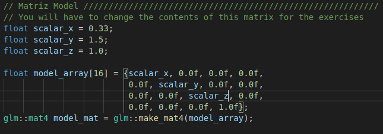

# The Graphics Pipeline

## **Abstract**

In this assignment, I will implement geometric transformations that make up the structure of the graphic pipeline. This implementation will be done with the help of the GLM library and its execution will occur in the OpenGL shaders. This activity will be done from a C++ template code provided by the professor, which is available in the [course's repository](https://github.com/capagot/icg).

NOTE: This is the short version of the assignment's article. If you want the long version explaining details about the graphics pipeline, please access the [long version](article.md) (**UNDER CONSTRUCTION**).

---
## **Dependencies and Compilation Instructions**

All requirements for this assignment are described in [Assignment #2 README](https://github.com/jpvt/Computer_Graphics/blob/master/Assignment%20%232/README.md). Check it out!

The compilation instructions are described in the README of the respective code folders.

---
## **Introduction**

In the context of computer graphics, the graphics pipeline is a conceptual model that describes what steps a graphics system needs to perform to render a 3D scene to a 2D screen. It consists of a series of algebraic transformations that are divided into a few stages.

  

    Figure 1. Representation of the graphics pipeline

---

## **Geometric Transformations**

To go through the graphics pipeline, geometric transformations are made from one space to another. Most of these transformations are made by a linear operator, which in this case will be a matrix over the vectors that compose an object, transforming them from one vector space to another. The main transformations that will be covered in this article are:

* Scale;
* Shear;
* Rotation;
* Translatation.

Geometric transformations can be classified as:

* **Linear transformations:**
  - Maps straight lines to straight lines;
  - Can be expressed in matrix form;
  - Examples:
    * Scale, rotation and shear.
  
* **Affine transformations:**
  - Include all linear transformations;
  - Preserves parallelism between lines;
  - Examples:
    * Scale, rotation, shear and *translation*.

* **Projective transformations:**
  - Include all affine transformations;
  - Keep straight lines straight;
  - Do not preserve parallelism between lines;
  - Examples:
    * Scale, rotation, shear, translation and *homogeneous projection*. 

  

    Figure 9. Geometric transformation Classification

---

## **The Assignment**

The activity consists of changing, in the template program, the contents of the MModel, MView, and MProjection matrices so that the program generates the images specified in each exercise. This assignment uses only the scene described below.

## Scene
The scene consists of two triangles (red and blue), with the red triangle slightly ahead of the blue triangle concerning the camera.

  

    Figure 10. The Scene

The geometric configuration of the rendered scene can be seen in the following images:

  

    Figure 11. XY plane (negative Z axis into the image plane)

  

    Figure 12. XYZ axes visualization

  

    Figure 13. ZY plane (negative X axis into the image plane)

## Exercise 1: Scale

In this exercise, I had to modify the Matrix model with the following scale factors: 

  

Scaling affects the dimensions of an object so that each coordinate of a vector **A** is multiplied by its scalars. So this transformation can change the length and even direction of a vector.

  

Then, by replacing the scalar values with those requested in the exercise

  

  

    Figure 14. Matrix model modification in code

The result is:

  

    Figure 15. Exercise 1 result

## **Credits**

* [Graphics Pipeline Wikipedia](https://en.wikipedia.org/wiki/Graphics_pipeline)
* [Pipeline Gráfico - Raul Britto](http://raulbritto.blogspot.com/2016/10/pipeline-grafico.html)
* [Chapter 6 - Fundamentals of Computer Graphics - Peter Shirley](https://www.amazon.com.br/dp/B009TG9NIQ/ref=dp-kindle-redirect?_encoding=UTF8&btkr=1s)