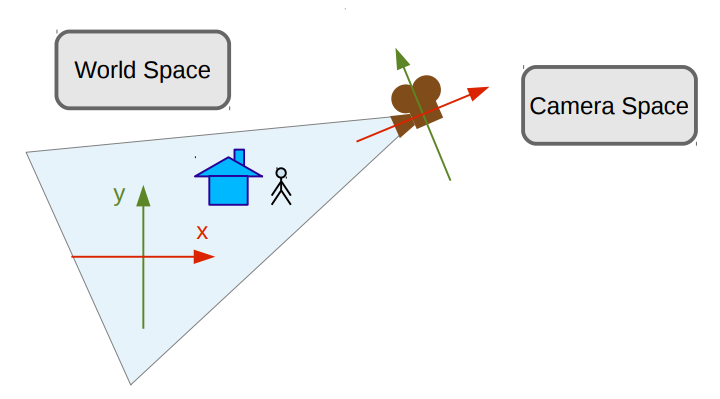

# The Graphics Pipeline

## **Abstract**

In this assignment, I will implement geometric transformations that make up the structure of the graphic pipeline. This implementation will be done with the help of the GLM library and its execution will occur in the OpenGL shaders. This activity will be done from a C++ template code provided by the professor, which is available in the [course's repository](https://github.com/capagot/icg).

## **Introduction**

In the context of computer graphics, the graphics pipeline is a conceptual model that describes what steps a graphics system needs to perform to render a 3D scene to a 2D screen. It consists of a series of algebraic transformations that are divided into a few stages. In this article, I will explain all the steps of the graphics pipeline and demonstrate them with some code.

  

    Figure 1. Representation of the graphics pipeline

### **Object Space**

  

The object space is the 3-dimensional space in which a graphic object is defined. In this space, the object's position depends only on the object itself. It is in this space that transformations related to the object, such as translation, rotation, and scaling occur. These transformations will be explained later in this article.

  

    Figure 2. Representation of a miniature being modeled in the object space

### **World Space**

  

The world space is the 3-dimensional space in which the position of the objects no longer depends on themselves, but their positions on the point they occupy in the space. This space can contain multiple objects, each one with their own object space.

  

    Figure 3. Representation of a world space with multiple objects

### **Camera Space**

  

The camera space adds new points of view to the scenes represented in the world space. This conjunct of views is represented by the camera space.

  

  

  

    Figure 4, 5, and 6. Images that represents the camera space in different points of view of a scene

### **Clipping and Canonical Space**

  

In the clipping space, a subspace of the scene, which is represented by the cube in the image above, is selected and will be the space that the next transformations will be applied to spam the canonical space..

In the canonical space perspective distortions were applied to the space, to cause, or not, the illusion of depth.

  

    Figure 7. In this distorted image, the castle in the background is with blur to cause the illusion of depth

### **Screen Space**

In the screen space, the canonical space pixels are addressed through the screen, then we can see a 3-dimensional transformed into a 2-dimensional image.

  

    Figure 8. Representation of a transformation to the Screen Space

## **Credits**

* [Graphics Pipeline Wikipedia](https://en.wikipedia.org/wiki/Graphics_pipeline)