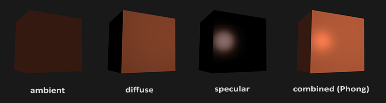
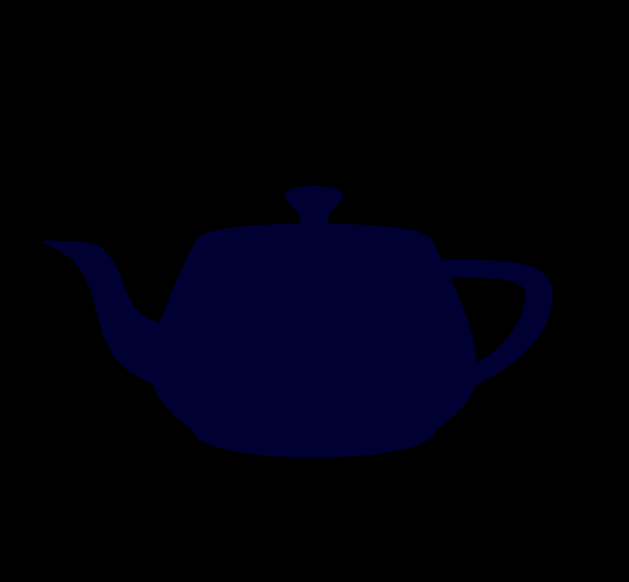
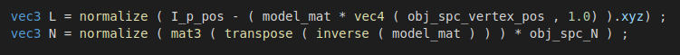
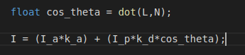
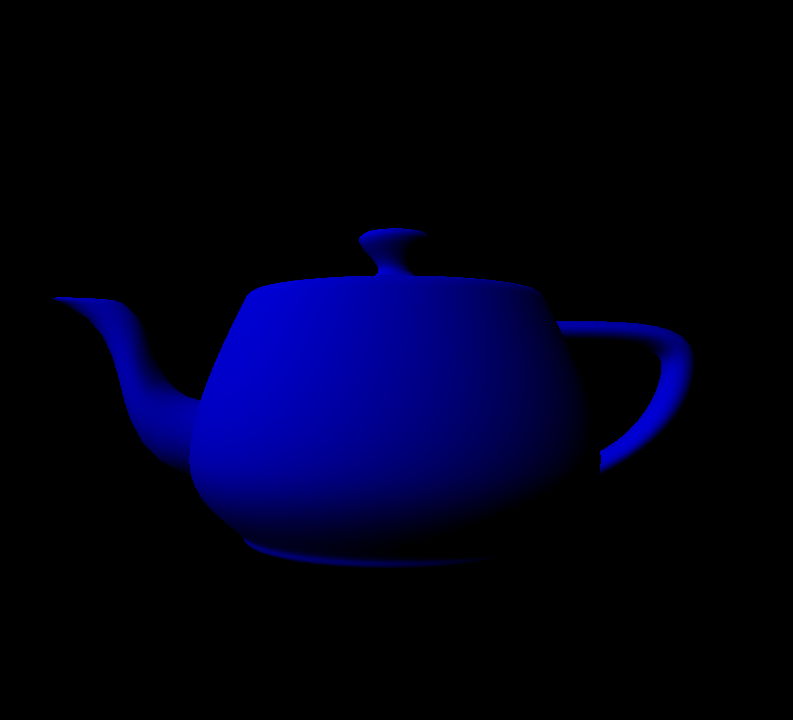

# Basic Lighting


## **Abstract**

In this assignment, I will implement lighting models traditionally used in rasterization: ambient, diffuse, and specular (or Phong). For this task, I will implement the three models using OpenGL's vertex shader. This activity will be done from a C++ template code provided by the professor, which is available in the [course's repository](https://github.com/capagot/icg).


---
## **Dependencies**

All requirements for this assignment are described in [Assignment #2 README](https://github.com/jpvt/Computer_Graphics/blob/master/Assignment%20%232/README.md). Check it out!

## **Compilation Instructions**

**Compilation**
```
$ make
```

**Cleaning**
```
$ make clean
```

**Run**
```
$ ./shading_gl
```

---
## **Introduction**

Lighting in the real world is extremely complicated and depends on way too many factors, something we can't afford to calculate on the limited processing power we have. These lighting models are based on the physics of light as we understand it. The major building blocks of the Phong lighting model consist of 3 components: ambient, diffuse and specular lighting.

<p align="center">
  
</p>
<p align="center">
    <sub>Figure 1. Components combined</sub>
</p>

LearnOpenGL's describes each component as:

* **Ambient lighting:** even when it is dark there is usually still some light somewhere in the world (the moon, a distant light) so objects are almost never completely dark. To simulate this we use an ambient lighting constant that always gives the object some color.

* **Diffuse lighting:** simulates the directional impact a light object has on an object. This is the most visually significant component of the lighting model. The more a part of an object faces the light source, the brighter it becomes.
 
* **Specular lighting:** simulates the bright spot of a light that appears on shiny objects. Specular highlights are more inclined to the color of the light than the color of the object.

---

## **The Assignment**

This activity consists of changing, in the template program, the content of the vertex shader (file **vertex_shader.glsl**) to add diffuse and specular reflection models. This assignment uses only the scene described below.

---

### **The Scene**

<p align="center">
  
</p>
<p align="center">
    <sub>Figure 2. The Scene, only Ambient Lighting</sub>
</p>

The scene to be rendered in this activity consists of a mesh of triangles representing the *Utah Teapot* and a point light source. The *teapot* is centered on the origin, while the point light source is located at the position (−2, 2, 1.5). The camera is located at position (0, 0, 1.5), with the vector Up = (0, 1, 0) and direction = (0, 0, −1). All positions are described in the Universe Space.


---

## Exercise 1: Diffuse lighting

I had to modify the vertex shader, so that it starts to include, in addition to the ambient lighting model, the diffuse model. 

Therefore, it will be necessary to calculate the new value of the normal vector N, after the transformations made by the Model matrix, as well as the vector L that points from the vertex to the light source.

To do so:

<p align="center">
  
</p>
<p align="center">
    <sub>Figure 3. Calculating N and L vectors</sub>
</p>

After calculating the N and L vectors, the diffuse lighting model to be evaluated should be:

<p align="center">
  
</p>
<p align="center">
    <sub>Figure 4. Diffuse lighting model</sub>
</p>

After the modifications in the template code, the result was:

<p align="center">
  
</p>
<p align="center">
    <sub>Figure 4. Exercise 1 Result, Diffuse lighting</sub>
</p>

The scene with the Ambient and Diffuse lighting combined.

---

## Exercise 2: Specular lighting


---

## **Discussion and difficulties about the assignment**


## **Credits**

* [Basic Lighting OpenGL](https://learnopengl.com/Lighting/Basic-Lighting#:~:text=Lighting%2FBasic-Lighting&text=These%20lighting%20models%20are%20based,ambient%2C%20diffuse%20and%20specular%20lighting.)
* Prof. Christian Notes