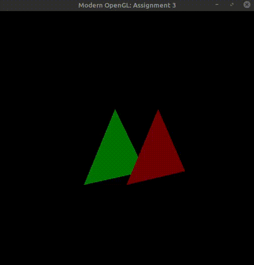
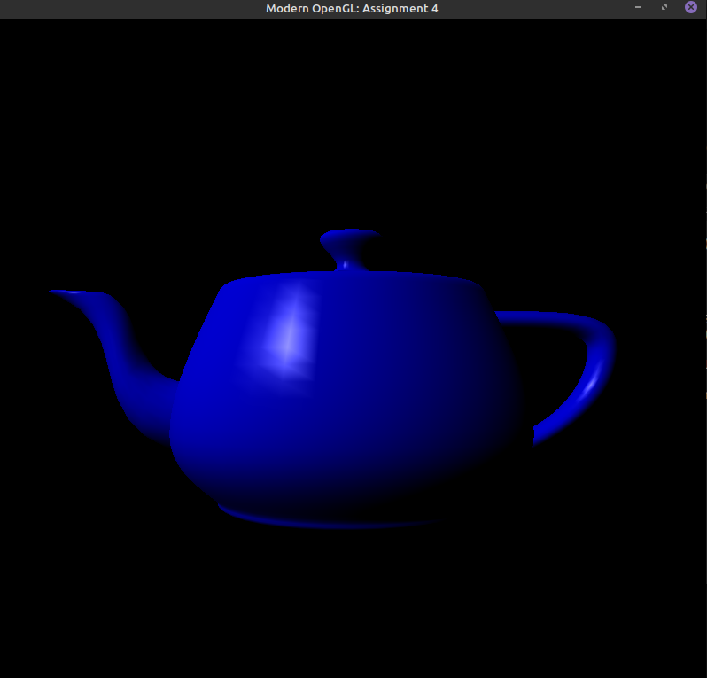
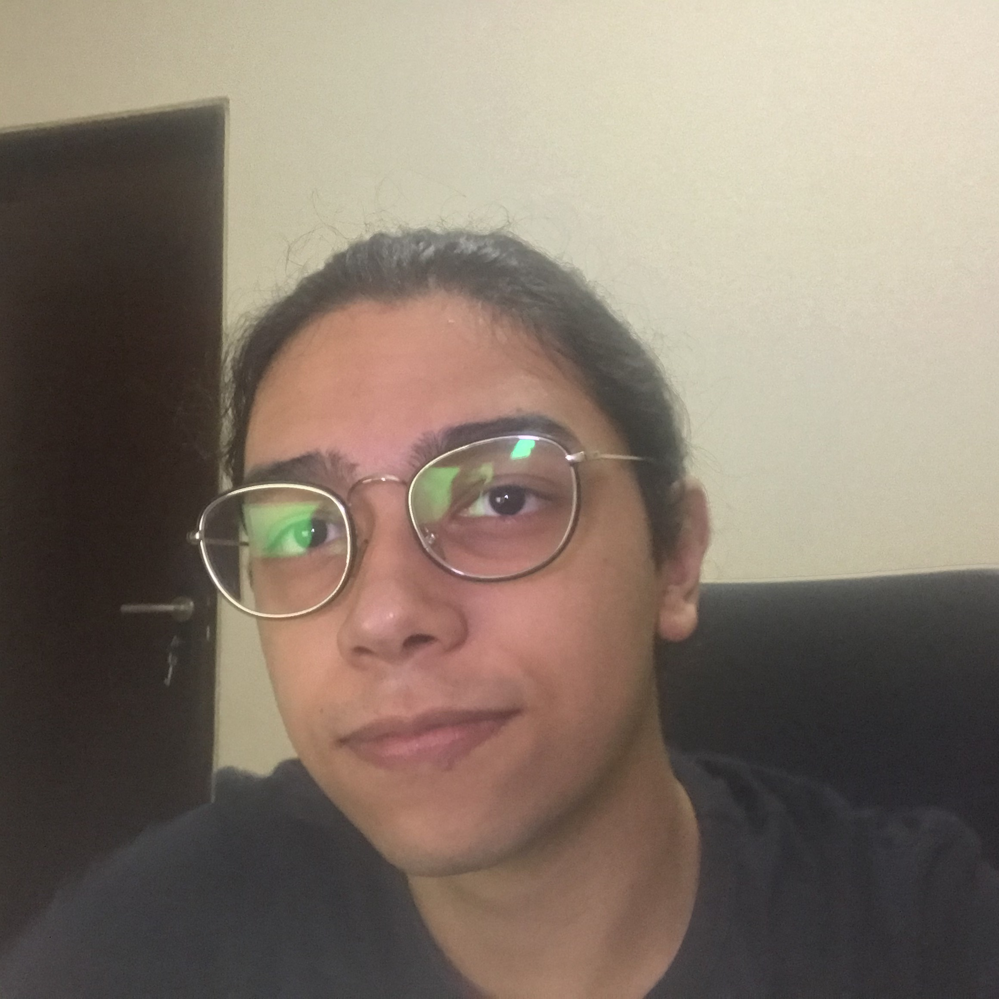

 

  

Repository dedicated to the assignments developed at Introduction to Computer Graphics course, oriented by Professor Christian Azambuja Pagot at Universidade Federal da Paraíba.

---

## Table of Contents
- [Table of Contents](#table-of-contents)
- [Books:](#books)
- [* ROGERS, David; ADAMS, J. Alan. Mathematical elements for computer graphics. New York: McGraw-Hill, 1990](#ullirogers-david-adams-j-alan-mathematical-elements-for-computer-graphics-new-york-mcgraw-hill-1990liul)
- [Assignments:](#assignments)
- [Clone](#clone)
- [Author](#author)
- [Support](#support)
- [License](#license)

---
## Books:

* BAKER, M. Pauline. Computer graphics. London: Prentice-Hall, 1986
* BUSS, Samuel R. 3-D Computer Graphics:A Mathematical Introduction with OpenGL. Cambridge: Cambridge University, 2005
* FOLEY, James D; VAN DAM, Andries. Fundamentals of interactive computer graphics. Reading, Mass.: Addison-Wesley Pub. Co., 1982
* WOO, Mason. OpenGL:programming guide. 3.ed. Boston: Addison-Wesley, 1999
* CONCI, Aura; AZEVEDO, Eduardo; LETA, Fabiana R. Computação gráfica:teoria e prática. Rio de Janeiro: Elsevier, 2008
* FOLEY, James D; DAM, Andries Van; FEINER, Steven K. Computer graphics:principles and practice. 2.ed.. Boston: Addison-Wesley, 1996
* ROGERS, David; ADAMS, J. Alan. Mathematical elements for computer graphics. New York: McGraw-Hill, 1990
---
## Assignments:

 *  [Assignment #1: Introduction to Rasterization Algorithms](https://github.com/jpvt/Computer_Graphics/tree/master/Assignment%20%231)

In this assignment, I implemented algorithms for the rasterization of points and lines. The rasterization of these primitives will be done by simulating direct access to video memory. As current operating systems protect memory from direct access, I will use a framework, provided by the professor, that simulates access to video memory.

*  [Assignment #2: Setting up OpenGL](https://github.com/jpvt/Computer_Graphics/tree/master/Assignment%20%232)

  

In this assignment, I'll show how to set up Modern OpenGL on Linux and how to run a simple image. Click on the image to check the video.

*  [Assignment #3: The Graphics Pipeline](https://github.com/jpvt/Computer_Graphics/tree/master/Assignment%20%233)

  

In this assignment, I will implement geometric transformations that make up the structure of the graphic pipeline. This implementation will be done with the help of the GLM library and its execution will occur in the OpenGL shaders.

*  [Assignment #4: Basic Lighting](https://github.com/jpvt/Computer_Graphics/tree/master/Assignment%20%234)

    

      
    

In this assignment, I will implement lighting models traditionally used in rasterization: ambient, diffuse, and specular (or Phong). For this task, I will implement the three models using OpenGL's vertex shader.

---

## Clone

- Clone this repo to your local machine using
> git clone https://github.com/jpvt/Computer_Graphics.git

---

## Author

<a href="https://www.linkedin.com/in/jpvt/" target="_blank">**João Pedro Vasconcelos**</a>
:---: 
 </img>
<a href="http://github.com/jpvt" target="_blank">`github.com/jpvt`</a>

*Computer Engineering undergrad student* at Universidade Federal da Paraíba

Hey, I'm João Pedro. (Since it's a complicated name to pronounce in english, you can call me JP)

I'm from São Paulo, Brazil. Though, I have spent most of my life where I currently live João Pessoa, Brazil.

I'm a Computer Engineering Undergrad student at the [Federal University of Paraíba](https://www.ufpb.br), and a Machine Learning Researcher at [ArIA - Artificial Intelligence Applications Laboratory](https://aria.ci.ufpb.br), where I've been studying Artificial Intelligence for the past months.

Outside of computer science, I enjoy learning random stuff, traveling, playing Dungeons & Dragons, and caffeine :)

**Background in:** C/C++, Python, Machine Learning, Data Analysis.

**Links:**
* [LinkedIn](https://www.linkedin.com/in/jpvt)
* [Personal Blog](https://jpvt.github.io)

---

## Support

Reach out to me at one of the following places!

- Email `joaoteixeira@eng.ci.ufpb.br` 
- Linkedin at <a href="https://www.linkedin.com/in/jpvt/" target="_blank">`jpvt`</a>

--- 
## License

- **[MIT license](https://github.com/jpvt/Computer_Graphics/blob/master/LICENSE)**

