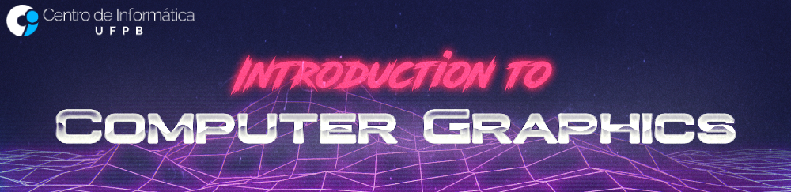

  

Repository dedicated to the assignments developed at Introduction to Computer Graphics course, oriented by Professor Christian Azambuja Pagot at Universidade Federal da Paraíba.

---
## Assignments:

 *  [Assignment #1: Introduction to Rasterization Algorithms](https://github.com/jpvt/Computer_Graphics/tree/master/Assignment%20%231)

In this assignment, I implemented algorithms for the rasterization of points and lines. The rasterization of these primitives will be done by simulating direct access to video memory. As current operating systems protect memory from direct access, I will use a framework, provided by the professor, that simulates access to video memory.

*  [Assignment #2: Setting up OpenGL](https://github.com/jpvt/Computer_Graphics/tree/master/Assignment%20%232)

In this assignment, I'll show how to set up Modern OpenGL on Linux and how to run a simple image.